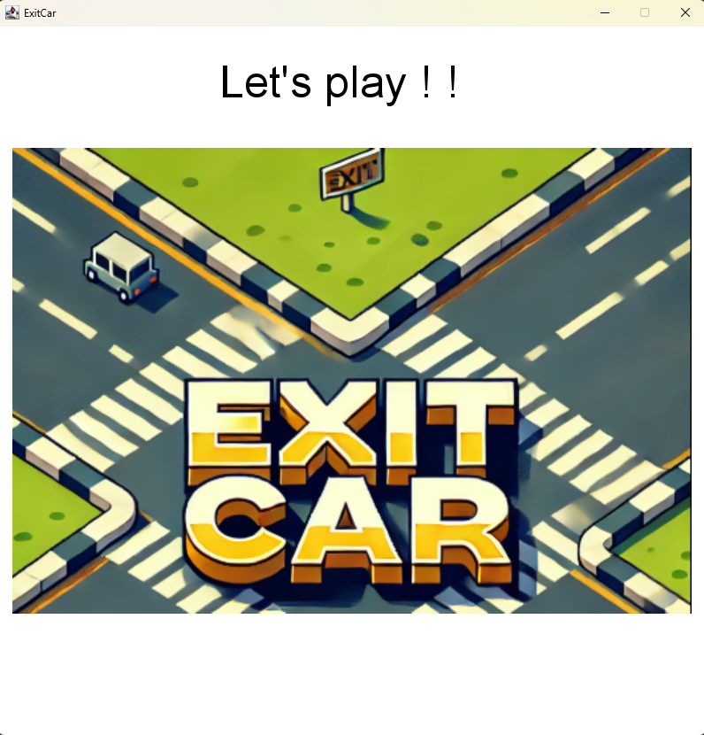
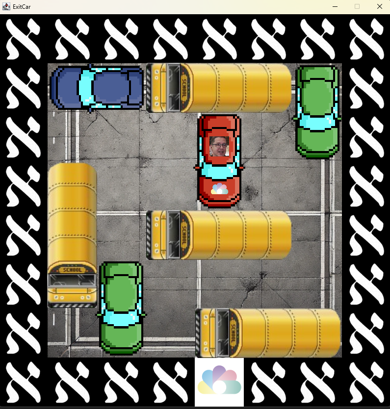
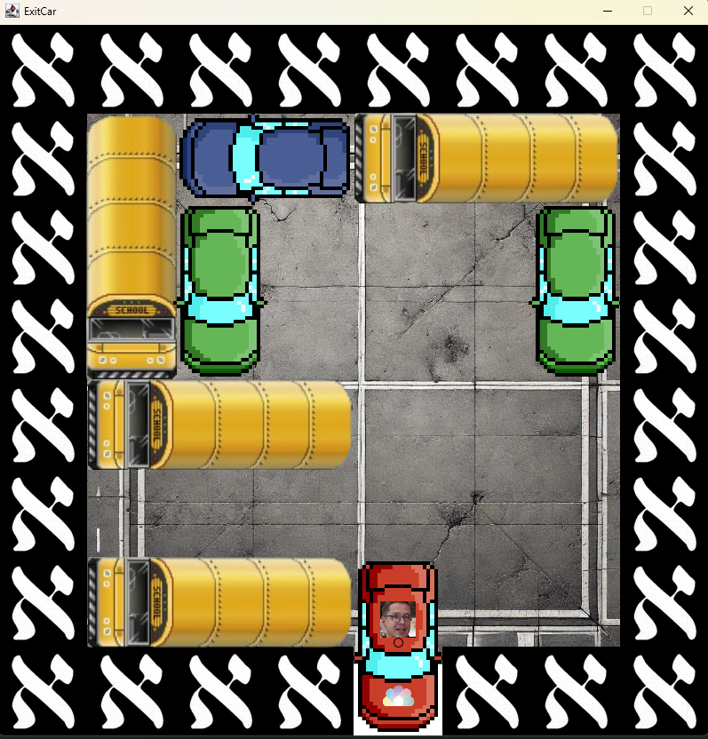

>

>Mot d'accueil du jeu

# **EXIT CAR**

## **Description du jeu**

**ExitCar** est un jeu de réflexion inspiré des classiques jeux de
casse-tête basés sur les embouteillages (Rush Hour). L\'objectif est de
déplacer des véhicules dans un parking encombré pour créer un chemin
permettant à la voiture rouge de sortir. Chaque niveau propose une
disposition unique, augmentant en complexité, et met à l\'épreuve les
compétences de réflexion stratégique et de résolution de problèmes du
joueur.

Le jeu utilise une grille pour représenter le parking, où les voitures sont
positionnées horizontalement ou verticalement, avec des tailles variées.
Le joueur contrôle les déplacements des voitures à l\'aide du clavier et
doit planifier ses mouvements pour atteindre l\'objectif.

> 

>Début et réussite du niveau

## **Mode d\'emploi**

1.  **Objectif** : Déplacez la voiture rouge jusqu\'à la sortie indiquée
    sur la grille (Logo ISC).

2.  **Commandes** :

    - **Souris** : Sélectionner une voiture en cliquant sur celle-ci
      dans la grille.

    - **Flèches directionnelles** : Déplacer la voiture sélectionnée
      dans les directions valides.

    - **Touche Q** : Quitter le jeu.

    - **Touche Y** : Rejouer après avoir fini le jeu.

    - **Touche N** : Quitter après avoir fini le jeu.

3.  **Progression** : Complétez tous les niveaux pour terminer le jeu.
    Chaque niveau introduit de nouveaux défis nécessitant une
    planification stratégique.

## **Structure du code**

Le code est organisé en plusieurs parties principales :

1.  **Initialisation** (Logic) :

    - La fenêtre graphique est créée avec FunGraphics, et des
      gestionnaires d\'événements sont configurés pour capturer les
      entrées du clavier et de la souris.

    - Une grille (playground) est utilisée pour représenter le parking.
      Les différentes cases de la grille sont codées avec des entiers
      pour indiquer les voitures, les murs et la sortie.

2.  **Gestion des entrées** (Logic) :

    - Les interactions du clavier sont gérées avec un KeyAdapter pour
      déplacer les voitures.

    - Les clics de souris sont capturés avec un MouseAdapter pour
      permettre de sélectionner une voiture.

3.  **Logique du jeu** (Logic) :

    - Les déplacements sont validés en fonction de l\'orientation et des
      espaces libres.

    - Les voitures ne peuvent se déplacer que dans des directions
      valides selon leur orientation (horizontale ou verticale).

    - La logique vérifie si le niveau est terminé lorsque la voiture
      rouge atteint la sortie.

4.  **Rendu graphique** :

    - La méthode level() gère l\'affichage de la grille, des voitures,
      des murs et de la sortie. (Play)

    - Des images (parfois personnalisées) sont utilisées pour
      représenter graphiquement les éléments du jeu. (Draw)

5.  **Progression et rejouabilité** :

    - Les niveaux sont initialisés via la fonction initLevel(), avec des
      dispositions spécifiques. (Logic)

    - Après avoir terminé tous les niveaux, le joueur peut choisir de
      rejouer ou de quitter. (Play)

6.  **Fonctions utilitaires** (Logic) :

    - Les fonctions comme findCar(), getHeight() et getWidth()
      permettent d\'obtenir la position et les dimensions des voitures
      sur la grille.

    - La méthode isEmpty() valide si une case est libre pour un
      déplacement.

    - Les fonctions playGround2Text() et previousPG2Text() facilitent le
      débogage en affichant l\'état actuel ou précédent de la grille.

7.  **Fin de jeu** (Play) :

    - À la fin du jeu, des messages et images appropriés sont affichés
      selon que le joueur décide de rejouer ou de quitter.

## **Evolutions possibles :**

- **Plus de niveaux** : Le code est conçu pour ajouter facilement de
  nouveaux niveaux en définissant des configurations supplémentaires
  dans la fonction initLevel(). Et en augmentant la variable finalLevel.

- **Personnaliser les voitures**: Comme pour la voiture rouge, il est
  possible de rajouter des personnages dans le jeu pour le rendre plus
  divertissant. Il suffit pour cela de séparer les case dans l'affichage
  des voitures dans Draw.bigCars et de mettre une voiture différente
  pour chaque cas.
